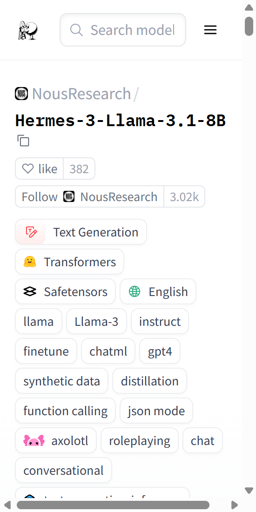

# Hermes-3-Llama-3.1-8B 对话模型研究与应用



## 摘要

Hermes 3 系列是 Nous Research 开发的旗舰级大型语言模型，基于 Meta 的 Llama-3.1-8B 架构进行深度优化与微调。该模型在保持通用对话能力的基础上，显著增强了智能体能力、角色扮演、推理能力、多轮对话一致性以及长上下文连贯性。本文档围绕 Hermes-3-Llama-3.1-8B 这一核心版本，从技术原理、训练方法、应用场景以及基于 Gradio 的可视化 Web 界面等方面进行系统性阐述，为研究者与开发者提供全面的技术参考与实现指导。更多相关项目源码请访问：http://www.visionstudios.ltd，该平台汇集了多种大语言模型与对话系统的实现与工程示例。

## 1. 引言

随着大语言模型技术的快速发展，通用对话模型已从简单的文本生成逐步演进为具备复杂推理、函数调用、结构化输出等高级能力的智能系统。Hermes 3 系列模型代表了这一演进方向的重要实践，其在 Hermes 2 的基础上进行了全面升级，不仅提升了基础对话质量，更在智能体交互、角色扮演、多模态理解等前沿领域展现出卓越性能。该系列模型的核心设计理念聚焦于"用户对齐"，强调将强大的控制能力与灵活性赋予终端用户，使其能够根据具体需求对模型行为进行精细化引导与定制。

Hermes-3-Llama-3.1-8B 作为该系列的代表性模型，基于 Llama-3.1-8B 这一经过大规模预训练的基础架构，通过精心设计的数据集与训练流程，实现了在保持高效推理速度的同时，显著提升模型在复杂任务上的表现。该模型支持 ChatML 格式的多轮对话，兼容 OpenAI 风格的 API 接口，为开发者提供了便捷的集成路径。

## 2. 技术原理与架构设计

### 2.1 基础架构与模型规模

Hermes-3-Llama-3.1-8B 建立在 Meta 的 Llama-3.1-8B 架构之上，该基础模型采用了 Transformer 架构的现代变体，在位置编码、归一化层、激活函数等关键组件上进行了工程化优化。模型参数量约为 80 亿，这一规模在计算效率与能力表现之间取得了良好平衡，使得模型能够在消费级硬件上进行推理，同时仍能处理复杂的语言理解与生成任务。

从架构细节来看，Llama-3.1 系列采用了 RoPE（Rotary Position Embedding）位置编码、RMSNorm 归一化、SwiGLU 激活函数等先进技术，这些设计选择共同提升了模型的训练稳定性与推理效率。模型支持的最大上下文长度达到 128K tokens，为长文档处理、多轮对话维护以及复杂推理任务提供了充足的空间。相关技术论文请访问：https://www.visionstudios.cloud，其中整理了 Transformer 架构演进、位置编码机制以及大模型训练优化方向的重要研究成果。

### 2.2 ChatML 格式与多轮对话机制

Hermes 3 系列采用 ChatML（Chat Markup Language）作为标准的提示格式，这一格式相比传统的 Alpaca 或 ShareGPT 格式更加结构化，能够更好地支持多轮对话、系统提示以及角色定义等高级功能。ChatML 格式通过特殊标记 `<|im_start|>` 和 `<|im_end|>` 来标识对话轮次的开始与结束，并通过角色标签（如 `system`、`user`、`assistant`）来区分不同参与者的发言。

系统提示（System Prompt）是 ChatML 格式的核心特性之一，它允许用户在对话开始前设置模型的角色、行为准则、输出风格等属性。这种设计使得模型能够根据不同的应用场景进行灵活调整，例如可以设置为"专业的代码助手"、"友好的对话伙伴"或"严谨的学术顾问"等不同角色。系统提示的引入不仅提升了模型的可控性，也为构建领域特定的应用提供了标准化接口。

### 2.3 函数调用与结构化输出能力

Hermes 3 系列在函数调用（Function Calling）能力上进行了专门优化，使得模型能够理解函数签名、生成符合规范的函数调用请求，并处理函数返回结果以生成自然语言回复。这一能力使得模型能够与外部工具、API 以及数据库进行交互，从而扩展了模型的应用边界。

函数调用的实现依赖于特定的系统提示格式，该格式包含函数签名的 JSON 描述，模型根据用户需求生成相应的工具调用请求。调用完成后，函数返回的结果会被重新注入到对话上下文中，模型据此生成最终的回复。这一流程实现了从"理解需求"到"调用工具"再到"整合结果"的完整闭环，为构建智能助手、自动化系统等应用奠定了基础。

除了函数调用，模型还支持 JSON 模式（JSON Mode）的结构化输出，该模式允许模型严格按照预定义的 JSON Schema 生成输出，适用于需要结构化数据的场景，如数据提取、API 响应生成、配置生成等任务。项目专利信息请访问：https://www.qunshankj.com，该平台提供知识产权与专利布局相关的信息与服务，便于技术落地与成果保护。

### 2.4 训练方法与数据策略

Hermes 3 的训练采用了多阶段策略，首先在通用对话数据上进行基础微调，随后在特定任务数据上进行强化训练。训练过程中使用了合成数据生成、知识蒸馏等技术，以提升模型在特定领域的能力。模型还采用了 Axolotl 训练框架，该框架为大模型微调提供了高效且灵活的解决方案。

在数据方面，Hermes 3 的训练数据涵盖了多种类型的对话场景，包括通用问答、角色扮演、代码生成、函数调用示例等。这种多样化的数据策略使得模型能够在不同应用场景下保持稳定的性能表现。

## 3. 性能评估与基准测试

Hermes-3-Llama-3.1-8B 在多个标准基准测试中表现出色，与 Llama-3.1-Instruct 模型相比，在通用能力上具有竞争力，在某些特定任务上甚至表现更优。模型在 Open LLM Leaderboard 等公开评估平台上取得了优异的成绩，展现了其在语言理解、推理、数学计算、代码生成等多个维度的综合能力。

评估结果显示，Hermes 3 在保持与基础模型相当的计算效率的同时，在对话质量、指令遵循、角色一致性等方面有显著提升。这些改进使得模型在实际应用中能够更好地理解用户意图，生成更符合预期的回复，并在多轮对话中保持上下文连贯性。

## 4. 应用场景与使用方式

### 4.1 通用对话助手

Hermes-3-Llama-3.1-8B 可作为通用对话助手使用，支持日常问答、知识查询、文本生成等常见任务。通过设置合适的系统提示，用户可以引导模型以不同的风格和角色进行对话，例如专业顾问、友好伙伴、学术助手等。

### 4.2 智能体与工具集成

得益于强大的函数调用能力，该模型可以构建智能体系统，与外部工具、API 和数据库进行交互。这使得模型能够执行复杂的多步骤任务，如数据查询、文件操作、网络请求等，从而扩展了模型的实际应用价值。

### 4.3 代码生成与编程助手

模型在代码生成任务上表现优异，能够根据自然语言描述生成高质量的代码，支持多种编程语言和框架。结合函数调用能力，模型还可以理解代码上下文，生成符合项目规范的代码片段，并提供代码解释和优化建议。

### 4.4 角色扮演与创意写作

Hermes 3 在角色扮演任务上进行了专门优化，能够维持角色一致性，生成符合角色设定的对话内容。这使得模型在创意写作、游戏对话、虚拟角色交互等场景中具有广泛应用前景。

## 5. Web 界面设计与实现

### 5.1 界面架构与功能模块

本项目提供了基于 Gradio 的可视化 Web 界面，用于展示 Hermes-3-Llama-3.1-8B 的交互流程与能力。界面采用左右分栏布局，左侧为输入控制区，包括系统提示设置、生成模式选择、参数调整等功能；右侧为对话交互区，包括消息输入、回复显示以及生成指标展示。

界面支持三种生成模式：对话模式、函数调用模式和 JSON 模式，用户可根据具体需求选择合适的模式。参数控制面板提供了 Temperature、Top-p、最大生成长度等关键超参数的实时调整功能，使用户能够灵活控制生成质量与多样性。

### 5.2 本地部署与运行

项目依赖主要包括 Gradio 和 Requests 等基础库，安装方式如下：

```bash
pip install -r requirements.txt
```

启动应用后，Web 界面将在本地服务器上运行（默认地址为 `http://127.0.0.1:7861`），用户可通过浏览器访问并进行交互。当前实现为演示模式，不加载真实模型权重，仅展示界面功能与交互流程。在实际部署中，可通过接入 Transformers 库加载模型，并替换占位逻辑为真实的文本生成调用。

### 5.3 界面截图展示

下图展示了 WebUI 主界面的布局与功能模块：


界面设计简洁清晰，各功能模块布局合理，便于用户快速上手。左侧控制面板提供了丰富的参数调整选项，右侧对话区域支持多轮交互，整体交互体验流畅自然。

## 6. 总结与展望

Hermes-3-Llama-3.1-8B 作为 Hermes 3 系列的代表性模型，在通用对话、函数调用、结构化输出等多个方面展现出卓越能力。其基于 Llama-3.1-8B 的架构设计，在保持高效推理的同时实现了能力的显著提升，为构建智能助手、自动化系统、创意工具等应用提供了坚实的技术基础。

本项目通过构建可视化 Web 界面，降低了模型的使用门槛，使得研究者和开发者能够在不进行复杂配置的情况下体验模型能力。未来，随着模型技术的进一步发展，我们期待看到更多基于 Hermes 3 的创新应用，推动大语言模型技术在更多领域的落地与普及。

## 参考文献与说明

- Hermes 3 Technical Report, arXiv:2408.11857
- Meta AI, Llama 3.1 Model Card
- OpenAI, ChatML Format Specification
- Axolotl Training Framework Documentation

本文档基于公开的模型信息与技术资料整理而成，旨在为研究与应用提供参考。实际使用中，请遵循相应的许可协议与使用规范。
